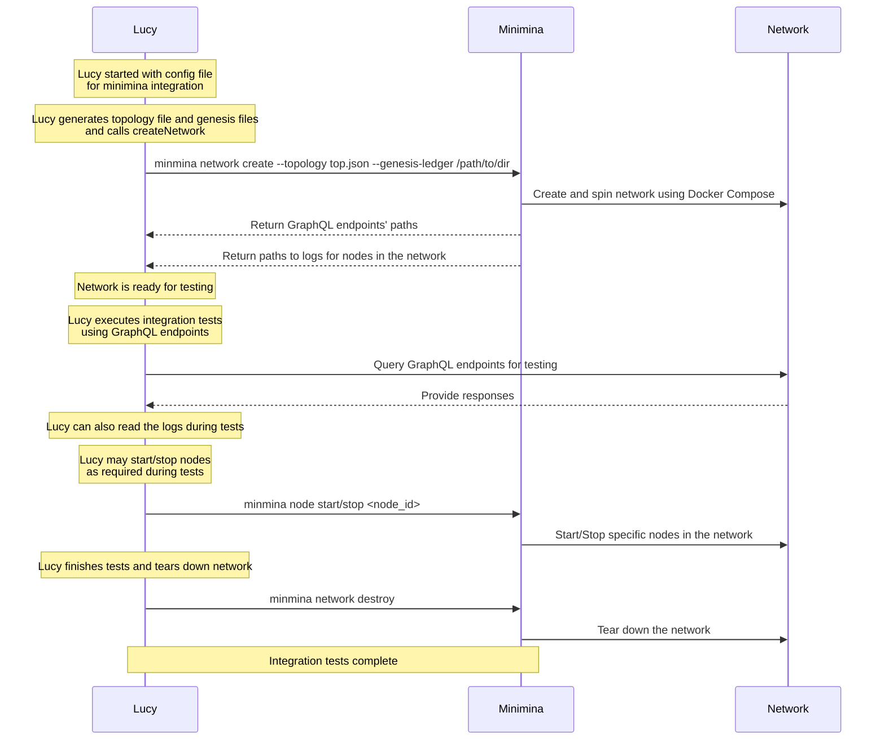

# MiniMina v2

# ****Introducing "minimina" - A Command line Tool for Spinning up Mina Network Locally****

## **Summary**

"minimina" is a command line tool aimed at providing the capability to spin up Mina networks locally on a user's computer. The tool will use Docker Compose as a means to deploy the network, enabling users to conduct integration tests of the Mina protocol outside of Google Cloud Platform (GCP). By decoupling the network creation from the integration tests, "minimina" aims to provide a more flexible and extensible approach.

## **Motivation**

The motivation behind "minimina" is to streamline the integration testing process for the Mina protocol. Currently, integration tests are conducted against GCP, which introduces dependencies and limitations. By developing "minimina," the goal is to create an external tool that allows users to locally deploy Mina networks, enabling faster, more efficient development, testing and debugging. This tool should be versatile enough to support various network topologies and allow the passing of custom genesis files to set up different initial conditions.

Integration tests in the Mina ecosystem are facilitated by an engine called [Lucy](https://github.com/MinaProtocol/mina/blob/develop/src/app/test_executive/README.md) (a.k.a. `test_executive`). Lucy generates the desired network topology and provides a list of actions and functions that need to be implemented on the "minimina" side. The integration tests framework ensures rigorous testing of Mina protocol functionalities, and "minimina" will act as the external engine to create and manage the networks required for these tests.

## **Detailed Design**

"minimina" will be developed as a commandline tool (the tech behind is under discussion, viable options could be Rust, Python, Ruby). The main components and functionalities of "minimina" include:

1. **Docker Compose Integration:** "minimina" will leverage Docker Compose to define and deploy the Mina network components, such as block-producers, snark-workers, and snark-coordinators. Docker Compose provides a declarative way to define services, networks, and volumes, making it easier to manage complex network topologies and enabling easy scaling of networks for testing purposes.
2. **Network Topology Generation:** Lucy's engine, which drives the integration tests, will generate the desired network topology in an agreed format. "minimina" will consume this topology information to create a corresponding Docker Compose file, configuring the Mina network accordingly.
3. **Genesis File Handling:** "minimina" will support the passing of custom genesis files to each node in the network. Lucy's engine will generate the genesis-ledger and keys, ensuring the nodes have the correct accounts and balances when the network starts.
4. **Node Identification and GraphQL:** "minimina" will enable querying of account balances and logs by sharing a GraphQL address that provides access to this information. Proper node identification mechanisms will be implemented to differentiate nodes belonging to different networks.
5. **Node Management:** The tool will provide functionalities to start and stop individual nodes within the Mina network. Docker Compose's capabilities will be assessed to determine if they suffice for managing nodes or if specific container interactions are needed.
6. **Custom Parameter Configuration:** For deploying Mina Daemons, "minimina" will allow passing specific parameters, such as the block-producer key for block-producing nodes.

The detailed design will also include provisions for handling port management and ensuring a clear distinction between nodes belonging to different networks.

Detailed template of which functions need to be supported by minimina is listed [here](https://www.notion.so/Template-for-Contract-Config-72dd3298e33c438f94f99af5b027305e?pvs=21). 

Below is a high-level diagram attempting to capture interactions between Lucy, Minimina and the Network.  

## **Drawbacks**

Potential drawbacks to consider for "minimina" include:

- Increased complexity in managing Docker Compose files for different network topologies.
- Docker Compose's limitations may impact certain functionalities, requiring additional container interactions.
- Integration with Docker might introduce compatibility issues with some environments.

## **Rationale and Alternatives**

The decision to use Docker Compose as the deployment mechanism is based on its containerization benefits, easy management, and scalability. Alternatives like a single Docker image or working with raw binaries were considered but deemed less flexible and less suitable for managing complex network topologies and node configurations.

## **Prior Art**

Several prior art implementations related to local Mina network scripts and Dockerized local network solutions have been examined. These include:

- Mina local network scripts (**[https://github.com/MinaProtocol/mina/tree/develop/scripts/mina-local-network](https://github.com/MinaProtocol/mina/tree/develop/scripts/mina-local-network)**)
- RFC for a Dockerized local network solution (**[https://github.com/o1-labs/rfcs/blob/main/0004-dockerised-local-network.md](https://github.com/o1-labs/rfcs/blob/main/0004-dockerised-local-network.md)**) and its implementation (**[https://hub.docker.com/r/o1labs/mina-local-network](https://hub.docker.com/r/o1labs/mina-local-network)**)
- Minimina v1, a Dockerized version of Mina local network scripts (**[https://hub.docker.com/r/minafoundation/minimina](https://hub.docker.com/r/minafoundation/minimina)**)

These prior art solutions offer valuable insights into potential design considerations and challenges.

## **Unresolved Questions**

Several questions and unknowns remain, including:

- How to distinguish nodes belonging to different networks on a local machine and manage their ports effectively.
    - This will be especially crucial for the case when there will be multiple networks running on the same machine. The possibility of employing `nginx` container needs to be explored. This nginx container can act as a reverse proxy, allowing us to expose a single port (e.g., 8080) and dynamically build the nginx configuration at runtime. This approach may offer improved network isolation and a more organized port management system.
- The extent to which Docker Compose can control individual nodes, or if additional container interactions are required for proper node management.
- A potential drawback is also increasing memory and CPU consumption as the number of nodes (or networks) increases. To address this concern, it would be valuable to benchmark the resource consumption of different dune profiles (Lightner vs. Devnet vs. Mainnet) to understand their impact on performance.
- An essential requirement for integration testing is the ability to run different versions of the Mina node in the same network. For example, testing an artifact produced by CI against the official “berkeley” release in the same network. Docker compose allows this capability, but we need to find elegant solution to capture this into the CLI tool.
- Do we need to provide access to PostreSQL for Lucy to directly query archive node database?

These questions will be addressed and resolved during the RFC process and the implementation phase.